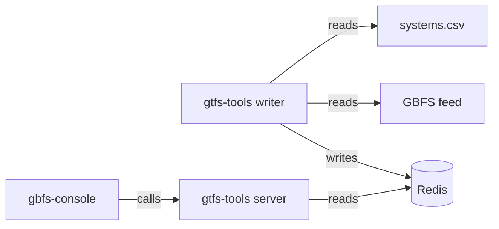

# gbfs-tools



* `cmd/server` – GraphQL & GeoJSON server, deployed to [gbfs.chuhlomin.com](https://gbfs.chuhlomin.com)
* `cmd/writer` – app that writes GBFS systems and feeds info into Redis

## Local development

Start with docker-compose:

```bash
docker-compose up -d
```

Verify that server is working properly by calling GraphQL:

```bash
curl -X "POST" "http://127.0.0.1:8082/graphql" \
     -H 'Content-Type: application/json; charset=utf-8' \
     -d $'{
	"query": "query{systems{edges{node{id name autoDiscoveryUrl countryCode location}}}}",
	"variables": {}
}'
```

To connect to Redis:

```bash
docker-compose exec redis redis-cli -a sOmE_sEcUrE_pAsS
```
